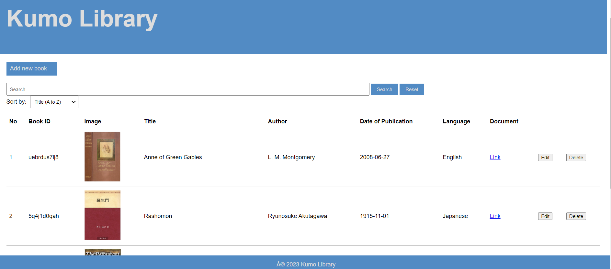
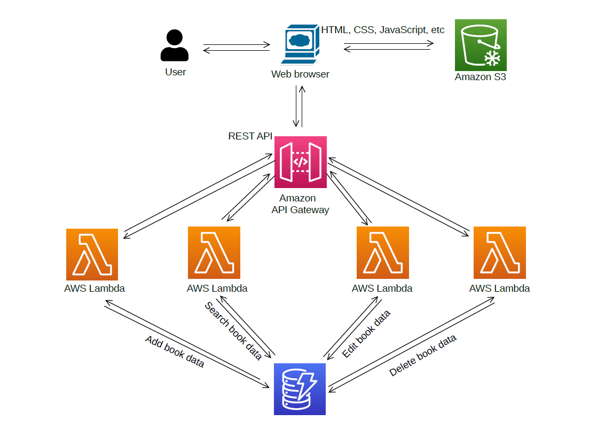

# Digital-Library-Management
Program for library management built with AWS using terraform

## Introduction
In this project, a serverless book library management application was implemented using AWS as the backend. The purpose of this application is to provide a platform where users can search for books from their digital library.

## Demonstration
Click and Watch the video below

## Components

- View your book collection.
- Provides search bar and sorting functionality to search books by author and title.
- Users can browse books by genre or view all available books.
- Each book displays the title, author, cover image, and publication date.
- You can also add and edit books

 ## AWS Services 

- `Amazon S3 (Simple Storage Service)`
- `AWS Lambda`
- `Amazon API Gateway`
- `Amazon DynamoDB`: 

## Architecture

 

The application's serverless architecture ensures high scalability and can easily handle increasing book data and user access. The backend functionality of your application is implemented using AWS Lambda functions, which are serverless compute units that execute code in response to events.

Book data for each book in the library is stored in Amazon DynamoDB, a NoSQL database service provided by AWS. This enables efficient and flexible storage and retrieval of book data.

Use Amazon API Gateway to provide the APIs needed to add, edit, delete, and search book information. Four REST APIs are created using API Gateway, and each API is configured to run a specific Lambda function when called.

- The `bookAdd` API, when called with the appropriate parameters, triggers a Lambda function that adds book information to DynamoDB.

- The `bookEdit` API calls a Lambda function that updates existing book information in DynamoDB based on the specified parameters.

- The `bookDelete` API runs a Lambda function that deletes the specified book data from DynamoDB.

- The `bookSearch` API triggers a Lambda function that searches for books in DynamoDB based on the specified search parameters and returns the results.

By using API Gateway in conjunction with Lambda functions, your application can expose these REST APIs to clients, allowing them to effectively and securely perform operations (create, edit, add, delete) on book data. will do so.